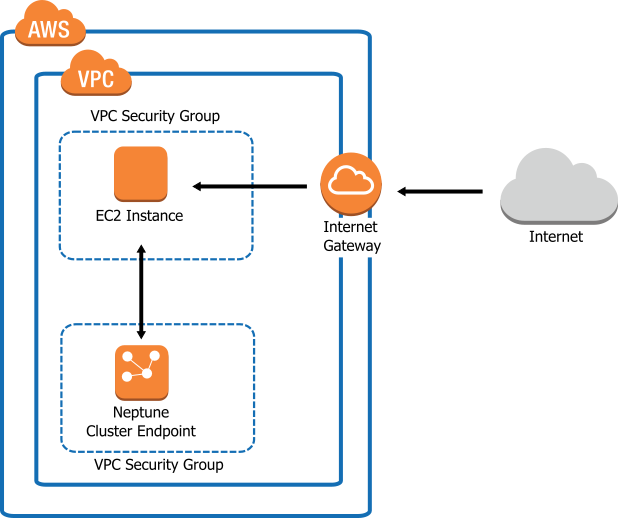

# AWS Neptune 

A graph database in the cloud


<small>https://gitpitch.com/seralf/aws-neptune-demo/drafts_seralf</small>


---

## who are we?


Marco Liberati


Alfredo Serafini


GraphRM

---

<span>
CHECK: come usare vertical fragments?
</span>

## Agenda - 1

- Overview AWS Neptune (cos'è, come funziona) ~ 5 minuti
- Cosa sono SPARQL e Gremlin ~ 2/3 minuti
- Property Graph o RDF? ~ 2/3 minuti
- Qualche nota di introduzione a SPARQL ~ 2/3 minuti
- Qualche query di esempio SPARQL ~ 5 minuti

---

## Agenda - 2

- Spiegazione dataset: http://www.dbis.informatik.uni-goettingen.de/Mondial/mondial-ER.pdf ~ 5/10 minuti
- Provare a risolvere il problema usando SQL ~ 2/3 minuti
- Provare a risolvere il problema usando SPARQL su Neptune ~ 5git  minuti
- Caso d'uso: Linked Data ~ 2/3 minuti
- QA ~ 5 minuti

TODO: slides vertical fragments


---

## AWS Neptune

TODO

@fa[puzzle-piece fa-spin pink]

---

### architectural overview



TODO

---

### neptune: some possible usage

- social networks
- recommendations
- fraud detection
- network analysis
- life sciences (bioinformatics, etc)
- knowledge graphs
- ML on graphs (DL and more...)
- textual analysis (see: NLP, conceptnet/wordnet...)

---

### features: pros / cons

+ built from scratch 
	NOTE: rumors about blazegraph team and code
+ no bias: adopts SPARQL or gremlin
+ pros of neptune:
	- optimized for storage / retrieval / queries on
	- highly connected data
	- querying graphs is hard on SQL

---

### features: pros / cons

+ features
	- based on blazegraph / acquire blazegraph team
	- SPARQL 1.1 + gremlin	
	- no support for SPARQL federated queries (security)
	- no inferencing
	- no schema concepts / constraints (SCHACL maybe?)
	- up to 64 terabytes storage, not statically allocated	
	- tested with hundred billions triples

### huge data handling


- NO load by SPARQL UPDATE da URL	
- load by HTTP API (VPC...)
- load by bulk load endpoint... TODO
- NOTE: load API not ACID

---

### what language for graphs?

+ SQL
+ SPARQL
+ gremlin
+ cypher
+ grakn.ai language
+ more ?


---

## SQL examples

TODO

---

## SPARQL examples

let's se some code...

---

### SPARQL examples

---?code=src/ex01.sparql&title=The first SPARQL query!

+++

### SPARQL examples

+ counting all the triples

```sparql
SELECT (COUNT(*) AS ?triples)
WHERE {
?s ?p ?o .
}

```

+ counting triples by concept

```sparql
SELECT (COUNT(?p) AS ?triples)
WHERE {
?s a ?concept .
?s ?p ?o .
}

```

---


* * * 

## QA


 
