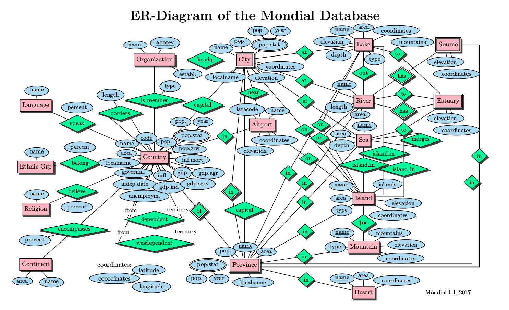
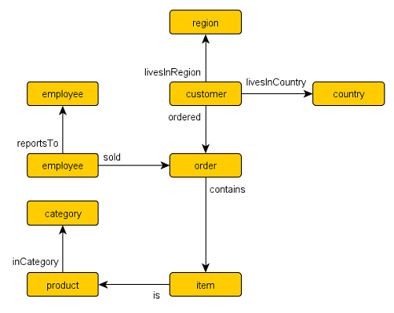
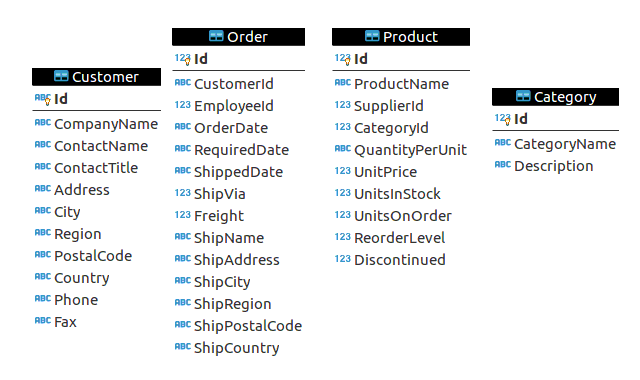
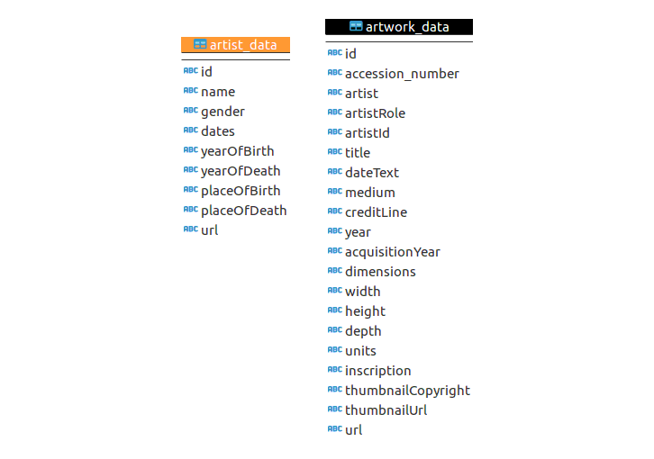

# AWS Neptune 

A graph database in the cloud


<small>https://gitpitch.com/seralf/aws-neptune-demo/drafts_seralf</small>


---

## who are we?


Marco Liberati


Alfredo Serafini


GraphRM

---

<span>
CHECK: come usare vertical fragments?
</span>

## Agenda - 1

- Overview AWS Neptune (cos'è, come funziona) ~ 5 minuti
- Cosa sono SPARQL e Gremlin ~ 2/3 minuti
- Property Graph o RDF? ~ 2/3 minuti
- Qualche nota di introduzione a SPARQL ~ 2/3 minuti
- Qualche query di esempio SPARQL ~ 5 minuti

---

## Agenda - 2

- Spiegazione dataset: http://www.dbis.informatik.uni-goettingen.de/Mondial/mondial-ER.pdf ~ 5/10 minuti
- Provare a risolvere il problema usando SQL ~ 2/3 minuti
- Provare a risolvere il problema usando SPARQL su Neptune ~ 5git  minuti
- Caso d'uso: Linked Data ~ 2/3 minuti
- QA ~ 5 minuti

TODO: slides vertical fragments


---

## AWS Neptune

TODO

<i class="fa fa-puzzle-piece fa-spin pink" aria-hidden="true"> </i>

---

### architectural overview


TODO

---

### neptune: some possible usage

- social networks
- recommendations
- fraud detection
- network analysis
- life sciences (bioinformatics, etc)
- knowledge graphs
- ML on graphs (DL and more...)
- textual analysis (see: NLP, conceptnet/wordnet...)

---

### features: pros / cons

+ built from scratch 
	NOTE: rumors about blazegraph team and code
+ no bias: adopts SPARQL or gremlin
+ pros of neptune:
	- optimized for storage / retrieval / queries on
	- highly connected data
	- querying graphs is hard on SQL

---

### features: pros / cons

+ features
	- based on blazegraph / acquire blazegraph team
	- SPARQL 1.1 + gremlin	
	- no support for SPARQL federated queries (security)
	- no inferencing
	- no schema concepts / constraints (SCHACL maybe?)
	- up to 64 terabytes storage, not statically allocated	
	- tested with hundred billions triples

### huge data handling


- NO load by SPARQL UPDATE da URL	
- load by HTTP API (VPC...)
- load by bulk load endpoint... TODO
- NOTE: load API not ACID

---

### what language for graphs?

+ SQL
+ SPARQL
+ gremlin
+ cypher
+ grakn.ai language
+ more ?


---

## SQL examples

TODO

---

## SPARQL examples

let's se some code...

+++

```
# a list of all the used concepts

SELECT ?concept 

WHERE {

	?s a ?concept .

}

```

+++


counting all the triples

---

<span class='menu-title slide-title'>counting all the triples</span>
```sparql
SELECT (COUNT(*) AS ?triples)
WHERE {
?s ?p ?o .
}

```


+++

counting triples by concept

```sparql
SELECT (COUNT(?p) AS ?triples)
WHERE {
?s a ?concept .
?s ?p ?o .
}

```

---


## big players

+ amazon
+ datastax
+ cloud / premise


+++

## tools

blazegraph
virtuoso
RDF4j
Jena
gremlinator


+++


## fonti:

http://sql2gremlin.com/
https://www.datastax.com/dev/blog/query-the-northwind-database-as-a-graph-using-gremlin
https://github.com/LITMUS-Benchmark-Suite/sparql-to-gremlin

https://github.com/jpwhite3/northwind-SQLite3/blob/master/Northwind_large.sqlite.zip


---


## some datasets

let's imagine some possibile dataset for testing...

+++


### mondial database



+++

### northwind



+++

## northwind dataset



+++

### tate collection




---

### analysis

lets' do some analysis 

---

### generic query (useful to "see" triples)

```
SELECT *
FROM <http://northwind>
WHERE {
	?s ?p ?o .
}
```

---

## northwind concepts list
```
SELECT DISTINCT ?concept 
FROM <http://northwind>
WHERE {
	?s a ?concept 
}
```

+++

+ ex response (blazegraph)
```
<http://northwind.com/model/Employee>
<http://northwind.com/model/Order>
<http://northwind.com/model/Product>
<http://northwind.com/model/Category>
<http://northwind.com/model/Customer>
<http://northwind.com/model/OrderDetail>
<http://northwind.com/model/Region>
<http://northwind.com/model/Shipper>
<http://northwind.com/model/Supplier>
<http://northwind.com/model/Territory>
owl:Ontology
owl:Class
rdfs:Class
owl:DatatypeProperty
owl:ObjectProperty
owl:Restriction
```

---

## Product properties
```
PREFIX nwd: <http://northwind.com/model/> 
SELECT DISTINCT ?prp  
FROM <http://northwind>
WHERE {
	?s1 a nwd:Product .
  	?s1 ?prp [] . 
}
```

+++

+ ex response
```
<http://northwind.com/model/category>
<http://northwind.com/model/discontinued>
<http://northwind.com/model/productName>
<http://northwind.com/model/quantityPerUnit>
<http://northwind.com/model/reorderLevel>
<http://northwind.com/model/supplier>
<http://northwind.com/model/unitPrice>
<http://northwind.com/model/unitsInStock>
<http://northwind.com/model/unitsOnOrder>
rdf:type
rdfs:label
```

---

## Category properties
```
PREFIX nwd: <http://northwind.com/model/> 
SELECT DISTINCT ?p    
FROM <http://northwind>
WHERE {
	?s1 a nwd:Category .
  	?s1 ?p [] .
}
```

+++

+ ex response
```
<http://northwind.com/model/categoryName>
<http://northwind.com/model/description>
rdf:type
rdfs:label
```

---

## Customer properties
```
PREFIX nwd: <http://northwind.com/model/> 
SELECT DISTINCT ?prp 
FROM <http://northwind>
WHERE {
	
  	?s a nwd:Customer .
  	?s ?prp [] .
}
```

+++

+ ex response
```
<http://northwind.com/model/companyName>
<http://northwind.com/model/contactName>
<http://northwind.com/model/contactTitle>
<http://northwind.com/model/fax>
<http://northwind.com/model/phone>
<http://northwind.com/model/country>
<http://northwind.com/model/region>
<http://northwind.com/model/city>
<http://northwind.com/model/address>
<http://northwind.com/model/postalCode>
rdf:type
rdfs:label
```

---

## Order properties

```
PREFIX nwd: <http://northwind.com/model/> 
SELECT DISTINCT ?prp 
FROM <http://northwind>
WHERE {
	
  	?s2 a nwd:Order . 
  	?s2 ?prp [] .
  
}
```

+++

+ ex response 
```
<http://northwind.com/model/customer>
<http://northwind.com/model/employee>
<http://northwind.com/model/freight>
<http://northwind.com/model/orderDate>
<http://northwind.com/model/requiredDate>
<http://northwind.com/model/shipAddress>
<http://northwind.com/model/shipCity>
<http://northwind.com/model/shipCountry>
<http://northwind.com/model/shipName>
<http://northwind.com/model/shippedDate>
<http://northwind.com/model/shipPostalCode>
<http://northwind.com/model/shipRegion>
<http://northwind.com/model/shipVia>
rdf:type
rdfs:label
```

---

## property by concept
```
SELECT DISTINCT ?concept ?prp  
FROM <http://northwind>
WHERE {
	?uri a ?concept .
  	?uri ?prp [] .  	
}
```

---

## count triples
```
SELECT (COUNT(*) AS ?triples)  
FROM <http://northwind>
WHERE {
	?s ?p ?o .
}
```

+ ex response
```33552```


---

## count triples by concept
```
SELECT ?concept (COUNT(?uri) AS ?triples)  
FROM <http://northwind>
WHERE {
	?uri a ?concept .
}
GROUP BY ?concept 
```

+++

+ ex response
```
concept	triples
owl:Ontology	2
owl:DatatypeProperty	44
owl:ObjectProperty	18
rdfs:Class	7
owl:Class	3
<http://northwind.com/model/Category>	8
<http://northwind.com/model/Customer>	91
<http://northwind.com/model/Employee>	9
<http://northwind.com/model/Order>	830
<http://northwind.com/model/OrderDetail>	3308
<http://northwind.com/model/Product>	77
<http://northwind.com/model/Region>	4
<http://northwind.com/model/Shipper>	3
<http://northwind.com/model/Supplier>	29
<http://northwind.com/model/Territory>	53
owl:Restriction	63
```

---

## count triples by concept / property
```
SELECT DISTINCT ?concept ?prp (COUNT(?uri) AS ?triples)  
FROM <http://northwind>
WHERE {
	?uri a ?concept .
  	?uri ?prp [] .
}
GROUP BY ?concept ?prp 
```

+++

for example for `OrderDetail`

```
SELECT DISTINCT ?concept ?prp (COUNT(?uri) AS ?triples)  
FROM <http://northwind>
WHERE {
	?uri a ?concept .
  	?uri ?prp [] .
  	FILTER(?concept=<http://northwind.com/model/OrderDetail>)
}
GROUP BY ?concept ?prp 
```

| concept | prp | triples |
| ------- | --- | ------- |
| nwd:OrderDetail | rdf:type | 3308 |
| nwd:OrderDetail | rdfs:label | 3308 |
| nwd:OrderDetail | nwd:discount | 2155 |
| nwd:OrderDetail | nwd:order |	2985 |
| nwd:OrderDetail | nwd:product | 2232 |
| nwd:OrderDetail | nwd:quantity | 2155 |
| nwd:OrderDetail | nwd:unitPrice | 2232 |


---


## sql2gremlin: some simple example


---

### sql2gremlin - select multiple columns

let's use sql2gremlin examples as a base for further inspections...

---

#### SQL>
```
SELECT CategoryName, Description
FROM Categories
```

+++

#### gremlin> 
```
g.V().hasLabel("category").valueMap("name", "description")
```

+++

#### SPARQL>
```
PREFIX nwd: <http://northwind.com/model/> 
SELECT DISTINCT ?category_name ?category_description  
FROM <http://northwind>
WHERE {
	?s a nwd:Category .
  	?s nwd:categoryName ?category_name .
  	?s nwd:description ?category_description .
}
```

+++

#### cypher> 

?

---

### sql2gremlin - joining

let's look at join usage...

---

#### SQL>

```
SELECT Products.ProductName
FROM Products
INNER JOIN Categories
ON Categories.CategoryID = Products.CategoryID
WHERE Categories.CategoryName = 'Beverages'
```

+++

#### gremlin> 
```
g.V().has("name","Beverages").in("inCategory").values("name")
```

+++

#### SPARQL
```
PREFIX nwd: <http://northwind.com/model/> 
SELECT DISTINCT ?product_name      
FROM <http://northwind>
WHERE {
  	?s1 a nwd:Product .
  	?s1 nwd:productName ?product_name .
	?s1 nwd:category ?s2 .
  	?s2 a nwd:Category .
  	?s2 nwd:categoryName ?category_name .
  	FILTER(STR(?category_name)="Beverages")
}
```

+++

+ più sintetica
```
PREFIX nwd: <http://northwind.com/model/> 
SELECT DISTINCT ?product_name      
FROM <http://northwind>
WHERE {
	
  	?s1 a nwd:Product ;
  		nwd:productName ?product_name ;
		nwd:category ?s2 .
  	?s2 a nwd:Category ;
  		nwd:categoryName ?category_name .
  
  	FILTER(STR(?category_name)="Beverages")
}
```

+++

+ usando direttamente l'URI
```
PREFIX nwd: <http://northwind.com/model/> 
SELECT DISTINCT ?product_name 
FROM <http://northwind>
WHERE {
	
  	?s1 a nwd:Product ;
  		nwd:productName ?product_name ;
		nwd:category ?s2 .
  	?s2 a nwd:Category ;
  		nwd:categoryName ?category_name .

  	FILTER(?s2=<http://northwind.com/Category-1>)
}
```

+++

+ NO: 616 results: it's a product!

```
PREFIX nwd: <http://northwind.com/model/> 
SELECT DISTINCT *   
FROM <http://northwind>
WHERE {
	?s1 a nwd:Product .
  	?s2 a nwd:Category .
}
```

----

### sql2gremlin - left joining

some more (still simple) join...

---

#### SQL>

```
SELECT Customers.CustomerID, COUNT(Orders.OrderID)
FROM Customers
LEFT JOIN Orders
ON Orders.CustomerID = Customers.CustomerID
GROUP BY Customers.CustomerID
```

+++

#### gremlin> 

```
g.V().hasLabel("customer").match(
   __.as("c").values("customerId").as("customerId"),
   __.as("c").out("ordered").count().as("orders")
).select("customerId", "orders")
```

+++

#### cypher> 

?

+++

#### SPARQL>

```
PREFIX nwd: <http://northwind.com/model/> 
SELECT DISTINCT ?customer_uri (COUNT(?order_uri) AS ?orders)
FROM <http://northwind>
WHERE {
	
  	?customer_uri a nwd:Customer . 
  	
  	?order_uri a nwd:Order .
  	?order_uri nwd:customer ?customer_uri .

}
GROUP BY ?customer_uri
```

+++

+ esempio ordinato: il customer con più ordini

```
PREFIX nwd: <http://northwind.com/model/> 
SELECT DISTINCT ?customer_name (COUNT(?order_uri) AS ?orders)
FROM <http://northwind>
WHERE {
	
  	?customer_uri a nwd:Customer . 
  	?customer_uri nwd:companyName ?customer_name .
  	
  	?order_uri a nwd:Order .
  	?order_uri nwd:customer ?customer_uri .

}
GROUP BY ?customer_uri ?customer_name 
ORDER BY DESC(?orders)
LIMIT 1
```

+++

+ esempio: customer senza ordini?

```
PREFIX nwd: <http://northwind.com/model/> 
SELECT DISTINCT ?customer_uri (COUNT(?order_uri) AS ?orders)
FROM <http://northwind>
WHERE {
	
  	?customer_uri a nwd:Customer . 
  	
  	OPTIONAL {
    	?order_uri a nwd:Order .
  		?order_uri nwd:customer ?customer_uri .
	}

}
GROUP BY ?customer_uri
ORDER BY ?orders 
LIMIT 1 
```

- risultato senza OPTIONAL:
```<http://northwind.com/Customer-CENTC>	1```

- risultato con OPTIONAL:
```<http://northwind.com/Customer-CENTC>	0```


---

## "gremlinator" tool examples...

let's consider a simple query

```
PREFIX nwd: <http://northwind.com/model/> 
SELECT (COUNT(?stock) as ?total)
WHERE {
	?product_uri nwd:category ?category_uri .
	?product_uri nwd:unitsInStock ?stock .
}
GROUP BY (?stock)
```

this could be rewritten for test by gremlinator


+++

SEE: http://195.201.31.31:8080/Demo/Gremlinator_query_demo?dataset=Northwind&querytype=Gc1


+ example query SPARQL

```
select (COUNT(?stock) as ?total)
where {
	?a e:inCategory ?c .
	?a v:unitsInStock ?stock .
}
GROUP BY (?stock)
```

+++

+ example query cypher (translated)
```
[GraphStep(vertex,[]), MatchStep(AND,[[MatchStartStep(a), VertexStep(OUT,[inCategory],vertex), MatchEndStep(c)], [MatchStartStep(a), PropertiesStep([unitsInStock],value), MatchEndStep(stock)]]), SelectOneStep(stock), GroupCountStep] 
```
gremlin> 
```
g.V().has("product", "unitsInStock").valueMap("name", "unitsInStock")
```


---


## DEMO ?

---


* * * 

## QA


 
